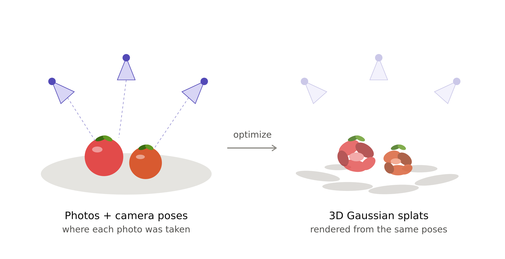

# Gaussian Splatting
Gaussian Splatting using COLMAP and the Bowl of Tomatoes dataset.

# Dataset
Download [Bowl of Tomatoes
dataset](https://www.kaggle.com/datasets/simonbethke/bowl-of-tomatoes?select=00000.jpg)
from Kaggle.

# Overview

