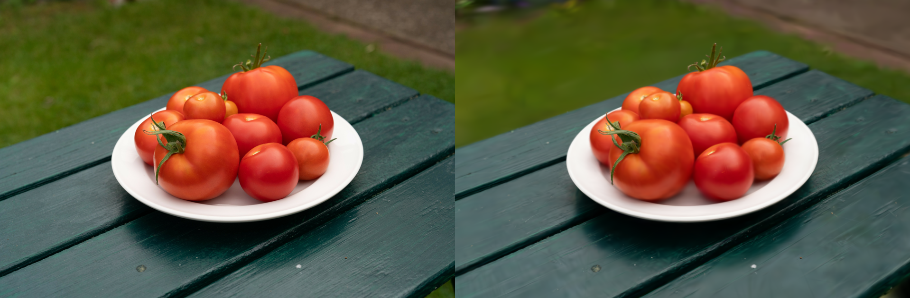

# Gaussian Splatting
Gaussian Splatting using COLMAP and the Bowl of Tomatoes dataset.

# Dataset
Download [Bowl of Tomatoes
dataset](https://www.kaggle.com/datasets/simonbethke/bowl-of-tomatoes?select=00000.jpg)
from Kaggle.

# Pipeline
The goal of 3D Gaussian Splatting is to represent a scene so it can be rendered from any new viewpoints.

# Results
**Left:** Ground truth training image. **Right:** Rendered Gaussian Splatting result.

Real-time rendering of the Gaussian Splatting reconstruction from different viewpoints.

  <video src="images/result.mp4" controls width="800"></video>

